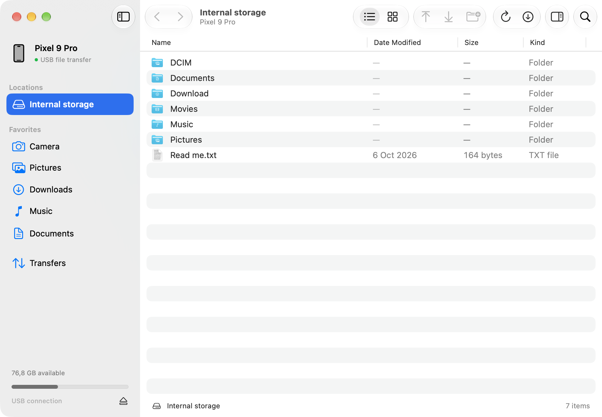

<p align="center">
  <a href="https://metope.org"></a>
</p>

<h1 align="center">Metope</h1>

<p align="center">
  <strong>Android file transfer. Built for the Mac.</strong><br />
  A small, native Mac app for browsing, organizing, and moving files over USB.
</p>

<p align="center">
  <a href="https://metope.org/downloads/Metope-0.1.0-arm64.zip"><strong>Download for Mac</strong></a> ·
  <a href="https://metope.org">Website</a> ·
  <a href="https://github.com/lekevicius/metope/issues">Report an issue</a>
</p>

<p align="center">macOS 26+ · Apple Silicon · Free and open source</p>

<p align="center">
  
  <br /><sub>The native Metope interface, shown with sample files.</sub>
</p>

## A familiar home for your Android files

- **Made for macOS.** SwiftUI, Liquid Glass, native menus, system appearance, and familiar keyboard shortcuts.
- **Browse your way.** List and icon views, folder search, sidebar favorites, and a file inspector. Press Space for Quick Look.
- **Move files and folders.** Drag from Finder to send to your phone, or select files to save to your Mac. Queue transfers and follow their progress.
- **Keep things organized.** Create folders, rename files, and delete items you no longer need.
- **Keep existing files intact.** Metope refuses to overwrite matching names and checks downloaded file sizes before saving.
- **Local and open.** USB transfers, no account, no analytics. Read, modify, and build the code under the [MIT license](LICENSE).

## Download and get connected

1. [Download Metope](https://metope.org/downloads/Metope-0.1.0-arm64.zip), unzip it, and move **Metope.app** to **Applications**.
2. Connect your Android device with a USB cable that supports data.
3. Unlock the device, choose **File Transfer** in its USB settings, and allow access if prompted.
4. Open Metope and browse your storage.

The download is Developer ID signed and notarized by Apple. It requires **macOS 26 or later on an Apple Silicon Mac**. Intel builds are not currently available. A [SHA-256 checksum](https://metope.org/downloads/Metope-0.1.0-arm64.zip.sha256) is provided alongside the download.

Want to look around first? Choose **Help → Show Sample Files** to explore the interface without a connected device.

## A few useful shortcuts

| Action | Shortcut |
| --- | --- |
| Quick Look | Space |
| Send to phone | ⌘U |
| Save to Mac | ⌘S |
| Go back / forward | ⌘[ / ⌘] |
| Enclosing folder | ⌘↑ |
| Refresh | ⌘R |
| Show hidden files | ⌘⇧. |
| File inspector | ⌥⌘I |
| Transfer history | ⌘J |

## Compatibility and help

Metope uses Android’s USB file-transfer protocol, MTP, and connects to one device at a time. If your device does not appear, check the cable, unlock the device, select File Transfer, and quit other Android file-transfer apps before refreshing.

**This is an early release.** Automated protocol and transfer-safety tests pass; physical-device compatibility has not yet been validated. Device reports are welcome—see the [testing status](docs/VALIDATION.md) and [report an issue](https://github.com/lekevicius/metope/issues).

Transfers never merge into or replace existing files. Downloads are staged and checked before being saved. Cancelling an upload can leave a partial file on the phone; interrupted downloads remain available for inspection. Transfers do not resume automatically.

## Build and contribute

With an Apple Silicon Mac and Xcode 27:

```sh
git clone https://github.com/lekevicius/metope.git
cd metope
./scripts/build.sh
open dist/Metope.app
```

Bug reports, device compatibility reports, documentation improvements, and pull requests are welcome. Read the [contributing guide](CONTRIBUTING.md) for reporting and testing guidance, and the [developer guide](docs/DEVELOPMENT.md) for architecture, tests, and release packaging.

## License and acknowledgments

Metope is available under the [MIT license](LICENSE).

Built with SwiftUI and **MetopeEngine**, a Swift MTP engine based on OpenMTP. USB transport uses [libusb](Vendor/libusb/README.md). Third-party components retain their own licenses; see [acknowledgments](Resources/ACKNOWLEDGMENTS.txt) for credits and notices.
